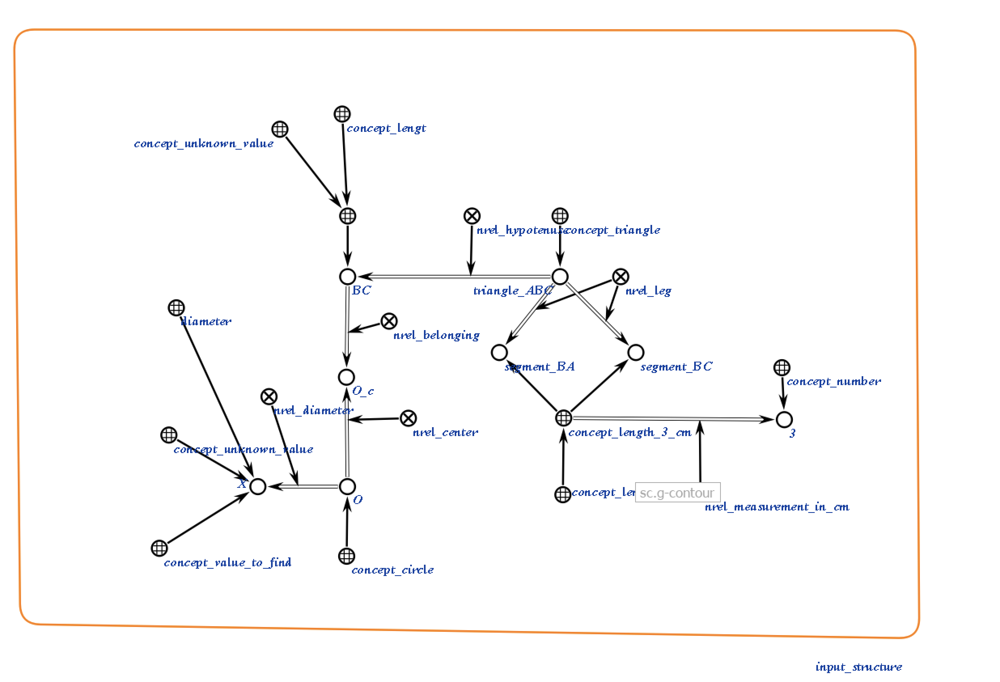
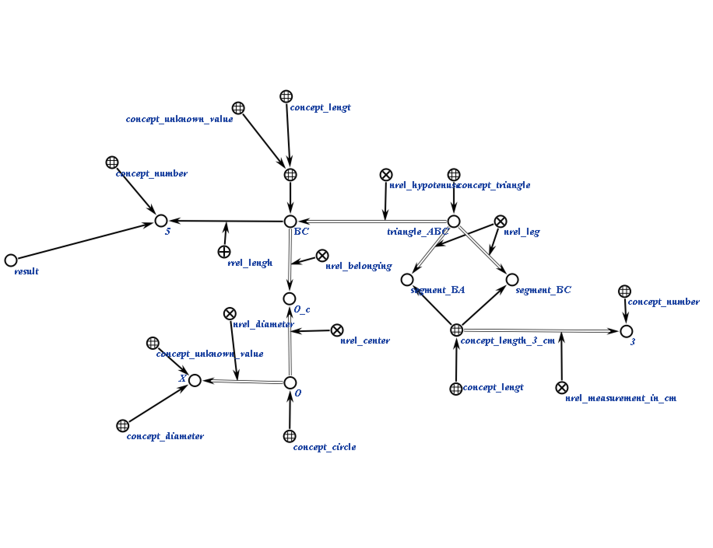
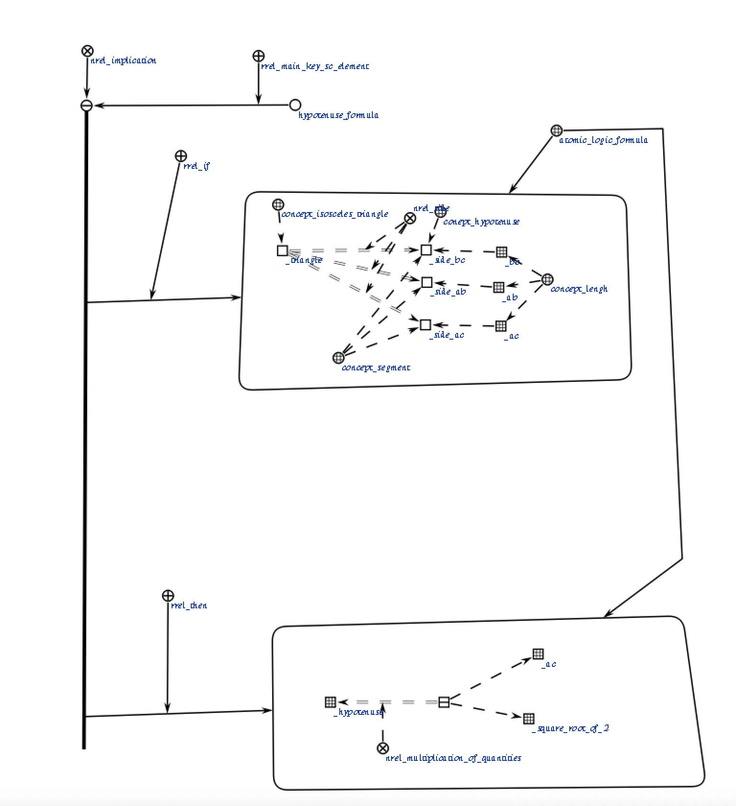

# Агент нахождения гипотенузы

Это агент, который находит гипотенузу треугльника, получая структуру треугольник, как параметр.

**Класс действия:**

`action_find_hypotenuse`

**Параметры:**

1. `triangle_Struct_Addr` — sc-ссылка на структуру треугльника.

**Рабочий процесс:**

* Агент проверяет, является ли треугольник прямоугольным и ровнобедренным, после чего находит гипотенузу.
 
### Пример

Пример входной структуры:

</img>

Пример выходной структуры:

</img>

### Логическое правило агента
</img>

### Результат

Возможные коды результата:
 
* `SC_RESULT_OK` — ответное сообщение сгенерировано;
* `SC_RESULT_ERROR` — внутренняя ошибка.
