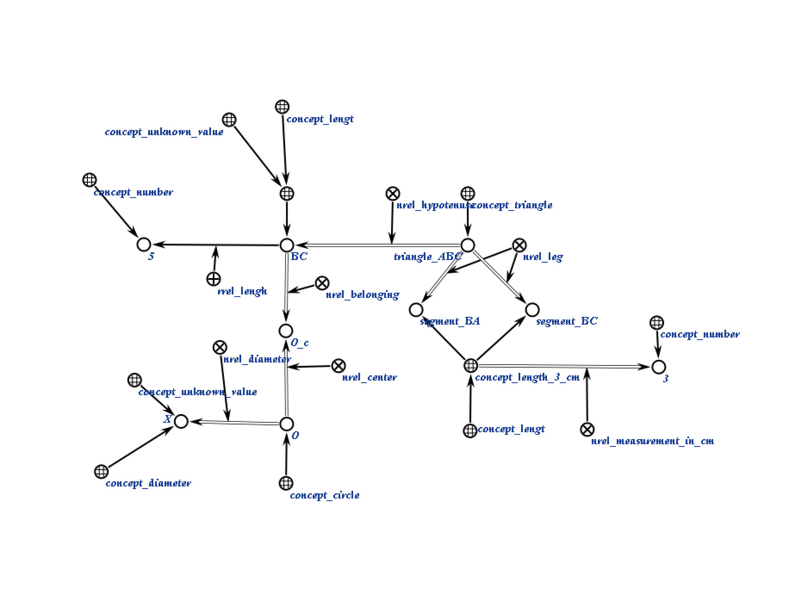
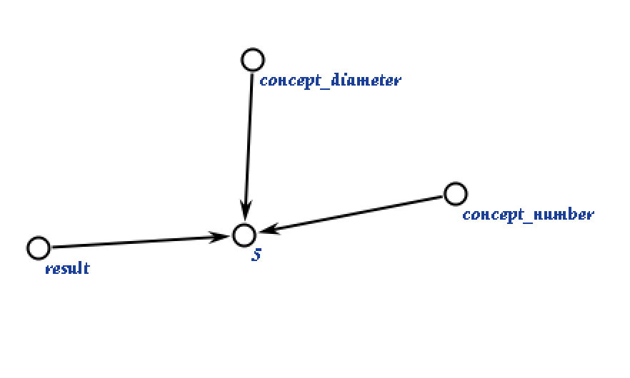
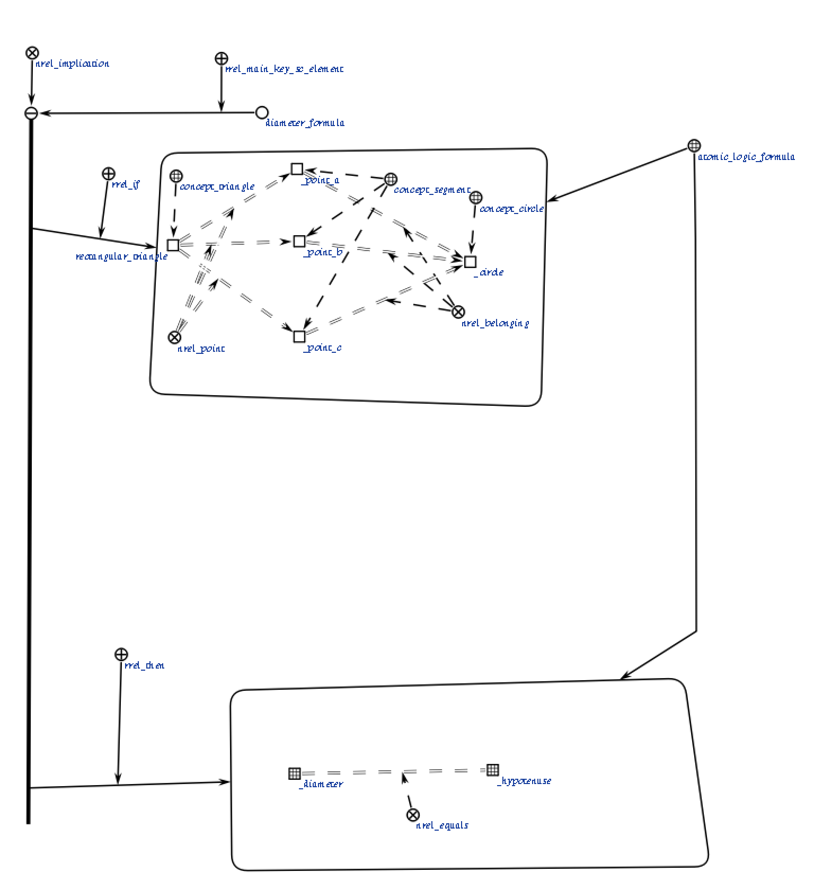

# Агент нахождения диаметра

Это агент, который находит диаметр окружности, получая структуру треугольника, как параметр.

**Класс действия:**

`action_find_diameter`

**Параметры:**

1. `triangle_Struct_Addr` — sc-ссылка на структуру треугльника.

**Рабочий процесс:**

* Агент проверяет, является ли треугольник вписанным, после чего находит диаметр.
 
### Пример

Пример входной структуры:

</img>

Пример выходной структуры:

</img>

### Логическое правило агента
</img>

### Результат

Возможные коды результата:
 
* `SC_RESULT_OK` — ответное сообщение сгенерировано;
* `SC_RESULT_ERROR` — внутренняя ошибка.
